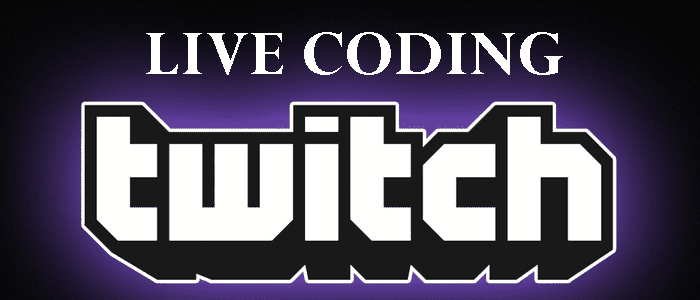

# Live Coding Brazil 🇧🇷

<!---Esses são exemplos. Veja https://shields.io para outras pessoas ou para personalizar este conjunto de escudos. Você pode querer incluir dependências, status do projeto e informações de licença aqui--->

> Apresento o projeto "Live Coding Brazil", um repositório em Markdown que destaca os streamers brasileiros de live coding, promovendo a comunidade e fornecendo referências para acompanhar o desenvolvimento de software em tempo real.

### Ajustes e melhorias

O projeto ainda está em desenvolvimento e as próximas atualizações serão voltadas nas seguintes tarefas:

- [x] Preparar a base
- [ ] Adicionar streamers
- [ ] Transformar em algo diferente do que estiver pronto👀

## 🎯 Do Objetivo

O objetivo do projeto "Live Coding Brazil" é destacar e promover a comunidade brasileira de live coding, reunindo os streamers em um repositório no GitHub para facilitar o acesso e acompanhamento das transmissões de desenvolvimento de software em tempo real.

## 📖 Regras para indexação de canais

Para que um canal seja adicionado ao **Live Coding Brazil**, é necessário seguir algumas regras:

* O conteúdo transmitido deve ser em português, para atender à comunidade brasileira.
* O canal deve se concentrar em live coding, abordando programação e desenvolvimento de software.
* O canal precisa ter uma frequência regular de transmissões para garantir consistência.
* É importante que o conteúdo seja educativo e interativo, promovendo o aprendizado e a troca de conhecimentos.
* O canal deve respeitar as diretrizes de conduta e ética, criando um ambiente seguro e inclusivo para todos os espectadores.

Por favor, note que estas são apenas diretrizes gerais e o projeto se reserva o direito de avaliar e selecionar os canais de acordo com critérios adicionais.

## ☕ Tópicos (A-Z)

- [Back-end](#Back-end)
- [C++](#C++)
- [Data Science](#Data-Science)
- [Front-end](#Front-end)
- [Full-Stack](#Full-Stack)
- [Geral](#Geral)
- [JavaScript](#JavaScript)
- [Laravel](#Laravel)
- [Node.js](#Node.js)
- [PHP](#PHP)
- [Python](#Python)
- [React](#React)
- [TypeScript](#TypeScript)
- [Vue.js](#Vue.js)

## 🖥️ Canais por Tópico (A-Z)

### Back-end
- [danielhe4rt](twitch.tv/danielhe4rt)
- [grandehe4rt](twitch.tv/grandehe4rt)

### C++
- [danielhe4rt](twitch.tv/danielhe4rt)

### Data-Science
- [teomewhy](twitch.tv/teomewhy)

### Front-end
- [ileonardohe4rt](twitch.tv/ileonardohe4rt)
- [moovheart](twitch.tv/moovhe4rt)

### Full-Stack
- [moovheart](twitch.tv/moovhe4rt)
- [Stherzada](twitch.tv/stherzada)

### Geral
- [He4rtDevs](twitch.tv/he4rtdevs)

### JavaScript
- [grandehe4rt](twitch.tv/grandehe4rt)
- [ileonardohe4rt](twitch.tv/ileonardohe4rt)

### Laravel
- [danielhe4rt](twitch.tv/danielhe4rt)

### Node.js
- [grandehe4rt](twitch.tv/grandehe4rt)

### PHP
- [danielhe4rt](twitch.tv/danielhe4rt)
- [grandehe4rt](twitch.tv/grandehe4rt)

### Python
- [grandehe4rt](twitch.tv/grandehe4rt)

### React
- [grandehe4rt](twitch.tv/grandehe4rt)
- [ileonardohe4rt](twitch.tv/ileonardohe4rt)

### TypeScript
- [grandehe4rt](twitch.tv/grandehe4rt)

### Vue.js
- [ileonardohe4rt](twitch.tv/ileonardohe4rt)

## 📫 Contribuindo para Live Coding Brazil
Para contribuir com Live Coding Brazil, siga estas etapas:

1. Bifurque este repositório.
2. Crie um branch: `git checkout -b <nome_branch>`.
3. Faça suas alterações e confirme-as: `git commit -m '<mensagem_commit>'`
4. Envie para o branch original: `git push origin livecoding-brazil / <local>`
5. Crie a solicitação de pull.

Como alternativa, consulte a documentação do GitHub em [como criar uma solicitação pull](https://help.github.com/en/github/collaborating-with-issues-and-pull-requests/creating-a-pull-request).

## 🤝 Colaboradores

Agradecemos às seguintes pessoas que contribuíram para este projeto:

## 😄 Seja um dos contribuidores 

Quer fazer parte desse projeto? Clique [AQUI](CONTRIBUTING.md) e leia como contribuir.

***
  
  ##  &nbsp;License

Shield: [![CC BY 4.0][cc-by-shield]][cc-by]

This work is licensed under a
[Creative Commons Attribution 4.0 International License][cc-by].

[![CC BY 4.0][cc-by-image]][cc-by]

[cc-by]: http://creativecommons.org/licenses/by/4.0/
[cc-by-image]: https://i.creativecommons.org/l/by/4.0/88x31.png
[cc-by-shield]: https://img.shields.io/badge/License-CC%20BY%204.0-lightgrey.svg
